# Obfuskačné a anti-debug techniky v ochrane softvéru

## 1. Analýza problémovej oblasti

### 1.1 Úvod do problematiky

Ochrana softvéru pred reverzným inžinierstvom je kritickou súčasťou bezpečnosti aplikácií. Útočníci používajú nástroje ako debuggery (x64dbg, GDB), disassemblery (IDA, Ghidra) a techniky ako hooking na analýzu a modifikáciu programov. Tento projekt implementuje a analyzuje obranné mechanizmy proti týmto útokom.

### 1.2 Ciele projektu

1. Implementovať compile-time XOR obfuskáciu citlivých reťazcov
2. Implementovať anti-debug kontroly pre Windows a Linux
3. Demonštrovať metódy obchádzania týchto ochranných mechanizmov
4. Vykonať komparatívnu analýzu efektivity implementovaných techník

---

## 2. Návrh riešenia

### 2.1 Architektúra aplikácie

```
┌─────────────────────────────────────────────────────────┐
│                      main()                             │
├─────────────────────────────────────────────────────────┤
│                check_platform_debug()                   │
├──────────────────────────┬──────────────────────────────┤
│ Windows                  │ Linux                        │
├──────────────────────────┼──────────────────────────────┤
│ IsDebuggerPresent        │ ptrace(PTRACE_TRACEME)       │
│ PEB->BeingDebugged       │ TracerPid kontrola           │
│ CheckRemoteDebugger      │ Parent process kontrola      │ 
│ NtQueryInformation       │ LD_PRELOAD detekcia          │
│                          │ Cmdline kontrola             │
├──────────────────────────┴──────────────────────────────┤
│              XOR Obfuskácia (Compile-time)              │
├──────────────────────────┬──────────────────────────────┤
│     print_real_flag()    │    print_fake_flag()         │
└──────────────────────────┴──────────────────────────────┘
```

### 2.2 Compile-time XOR obfuskácia

Implementovaná pomocou C++ template metaprogramovania:

```cpp
template<size_t N, char K>
struct CompileTimeXor {
    char data[N];
    
    constexpr CompileTimeXor(const char* input) : data{} {
        for (size_t i = 0; i < N; ++i) {
            data[i] = input[i] ^ K;
        }
    }
    
    std::string decrypt() const {
        std::string result(N - 1, '\0');
        for (size_t i = 0; i < N - 1; ++i) {
            result[i] = data[i] ^ K;
        }
        return result;
    }
};

#define CTXOR(str, key) []() { \
    static constexpr CompileTimeXor<sizeof(str), key> x(str); \
    return x.decrypt(); }()
```

**Výhody:**
- Reťazce sú zašifrované už počas kompilácie
- Nie sú viditeľné v binárke pomocou nástroja `strings`
- Dešifrovanie prebieha až za behu programu

### 2.3 Anti-debug techniky

#### Windows implementácia

| Technika                   | API/Metóda            | Detekcia                     |
| -------------------------- | --------------------- | ---------------------------- |
| IsDebuggerPresent          | `kernel32.dll`        | Priama kontrola              |
| PEB->BeingDebugged         | Čítanie PEB štruktúry | Kernel flag                  |
| CheckRemoteDebuggerPresent | `kernel32.dll`        | Vzdialený debugger           |
| NtQueryInformationProcess  | `ntdll.dll`           | DebugPort, DebugObjectHandle |

#### Linux implementácia

| Technika       | Metóda                   | Detekcia               |
| -------------- | ------------------------ | ---------------------- |
| ptrace         | `ptrace(PTRACE_TRACEME)` | Tracer pripojený       |
| TracerPid      | `/proc/self/status`      | PID tracera            |
| Parent process | `/proc/<ppid>/cmdline`   | Debugger ako rodič     |
| LD_PRELOAD     | `getenv("LD_PRELOAD")`   | Hooking knižnice       |
| Cmdline        | `/proc/self/cmdline`     | Debugger v argumentoch |

---

## 3. Implementačná časť

### 3.1 Kompilácia a príprava

```bash
# Linux
g++ main.cpp -o linux_antidebug -std=c++14

# Windows (MinGW)
g++ main.cpp -o windows_antidebug.exe -std=c++14
```

### 3.2 Testovanie obfuskácie

#### Test 1: Strings nástroj - Pred obfuskáciou

Bez XOR obfuskácie sú citlivé reťazce priamo viditeľné:

```bash
strings windows_antidebug.exe | grep -i "flag\|secret"
# Výstup: Flag{Real_Secret_B1T_2025}
```

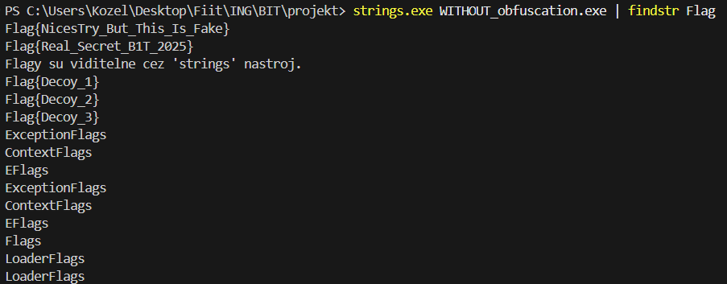
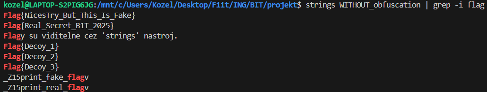

#### Test 2: Strings nástroj - Po obfuskácii

S XOR obfuskáciou reťazce nie sú viditeľné:

```bash
strings windows_antidebug.exe | grep -i "flag\|secret"
# Výstup: (žiadny)
```

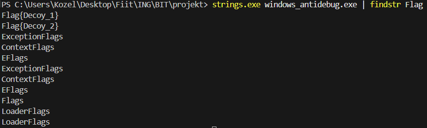
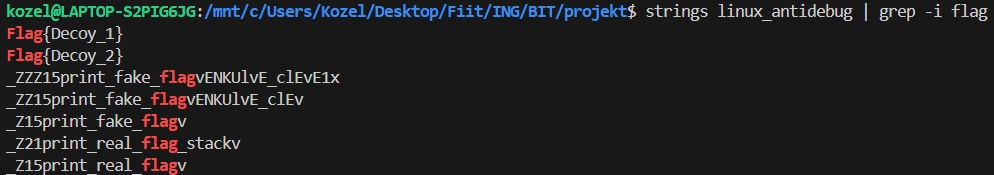

### 3.3 Testovanie anti-debug kontrol

#### Test 1: Spustenie v bežnom prostredí

Program bol spustený bez debugovacích nástrojov. Všetky kontroly prešli a program zobrazil skutočný flag.

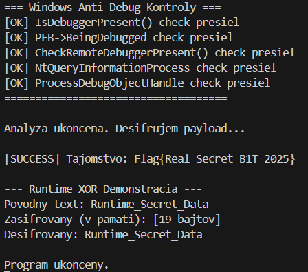
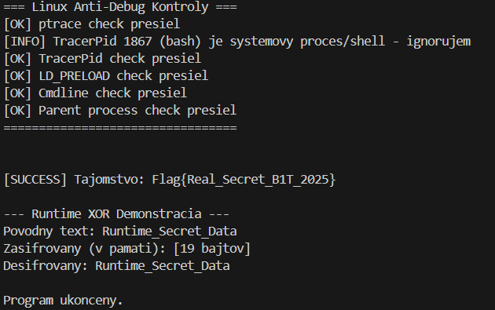

#### Test 2: Spustenie pod debuggerom (Windows - x64dbg)

Anti-debug kontroly úspešne detekovali prítomnosť debuggera:

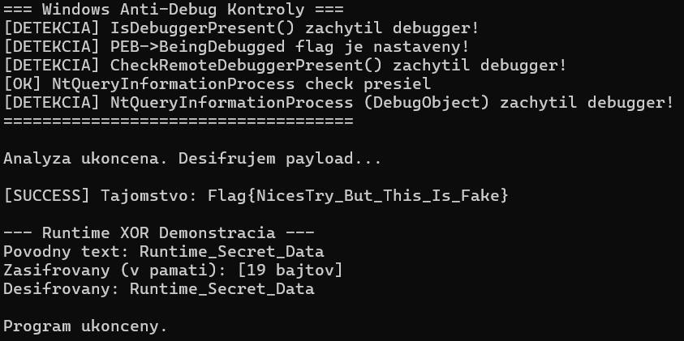

#### Test 3: Spustenie pod debuggerom (Linux - GDB)

```bash
gdb ./linux_antidebug
(gdb) run
```

Boli aktivované detekčné mechanizmy:
- `ptrace(PTRACE_TRACEME)` - základná detekcia
- `TracerPid` - kontrola /proc/self/status
- `Parent process` - kontrola rodiča

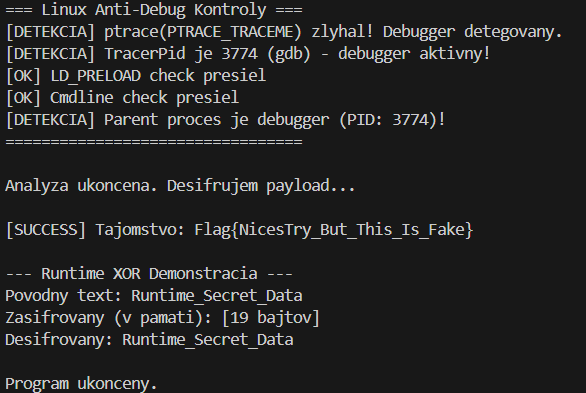

#### Test 4: Detekcia strace

```bash
strace -o /dev/null ./linux_antidebug
```

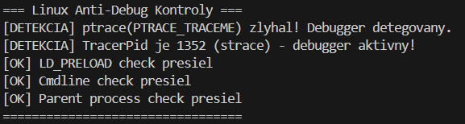

#### Test 5: Detekcia LD_PRELOAD

```bash
echo 'void dummy() {}' > dummy_hook.c
gcc -shared -fPIC -o dummy_hook.so dummy_hook.c
LD_PRELOAD=./dummy_hook.so ./linux_antidebug
```

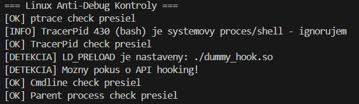

---

## 4. Obchádzanie ochranných mechanizmov

### 4.1 Windows - x64dbg

#### Metóda 1: Manuálne patchovanie

| Technika                   | Bypass metóda                 |
| -------------------------- | ----------------------------- |
| IsDebuggerPresent          | Breakpoint + zmena RAX na 0   |
| PEB->BeingDebugged         | Patch hodnoty na offsete +0x2 |
| CheckRemoteDebuggerPresent | Breakpoint + zmena RAX na 0   |
| NtQueryInformationProcess  | Zmena `je` na `jmp`           |

**Postup pre IsDebuggerPresent:**

Funkcia `IsDebuggerPresent` je Windows API volanie, ktoré vracia `TRUE` (1) ak je proces debugovaný a `FALSE` (0) ak nie. Bypass spočíva v zmene návratovej hodnoty.

1. Najprv som v x64dbg nastavil breakpoint na funkciu `IsDebuggerPresent` príkazom:
   ```
   bp IsDebuggerPresent
   ```
2. Po spustení programu sa vykonávanie zastavilo na vstupe do tejto funkcie
3. Klikol som na `Execute till return` (Ctrl+F9), čím sa funkcia vykonala až po inštrukciu `ret`
4. V tomto momente register RAX obsahoval návratovú hodnotu `1` (debugger detekovaný)
5. Manuálne som zmenil hodnotu RAX z `1` na `0`


**Rovnaký postup aj pre `CheckRemoteDebuggerPresent`** - táto funkcia kontroluje, či je k procesu pripojený vzdialený debugger. Opäť stačí zmeniť RAX na 0 po návrate z funkcie.

**Postup pre PEB->BeingDebugged:**

Process Environment Block (PEB) je interná Windows štruktúra, ktorá obsahuje informácie o procese. Na offsete `+0x2` sa nachádza bajt `BeingDebugged`, ktorý je `1` ak je proces debugovaný.

1. V x64dbg som použil príkaz na zobrazenie PEB štruktúry v hex dump okne:
   ```
   dump peb()
   ```
2. Tým sa mi zobrazil obsah pamäte začínajúci na adrese PEB
3. Na offsete `+0x2` (tretí bajt) bola hodnota `01` - indikátor debuggera
4. Zmenil hodnotu z `01` na `00`

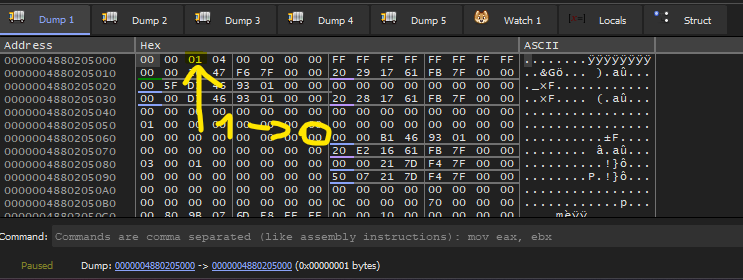

**Postup pre NtQueryInformationProcess:**

Táto funkcia z `ntdll.dll` je nízkoúrovňové API, ktoré môže vrátiť informácie o debug porte procesu (`ProcessDebugPort`) alebo debug object handle (`ProcessDebugObjectHandle`). Ak je proces debugovaný, tieto hodnoty sú nenulové.

1. Nastavil som breakpoint na funkciu:
   ```
   bp NtQueryInformationProcess
   ```
2. Po zastavení som použil `Step Over` (F8) na krokovanie cez funkciu
3. Sledoval som, kde program kontroluje návratovú hodnotu - hľadal som inštrukcie `test` a `cmp` nasledované podmieneným skokom
4. Našiel som kritické miesto:
   ```asm
   test rax, rax      ; Testuje či RAX je nula
   je   0x7FF647261A95 ; Skoč ak je nula (žiadny debugger)
   ```
5. Keďže RAX nebol nula (debugger detekovaný), skok sa nevykonal a program by šiel do vetvy "debugger found"
6. Inštrukciu `je` som zmenil na `jmp`:

Zmena podmieneného skoku na nepodmienený:
```asm
# Pred:
test rax, rax
je   0x7FF647261A95

# Po:
test rax, rax
jmp  0x7FF647261A95
```

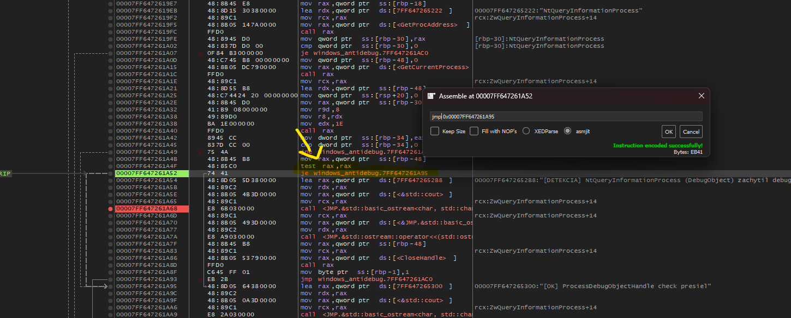

#### Metóda 2: ScyllaHide plugin

Jednoduchšia metóda - stačí nainštalovať ScyllaHide plugin a povoliť maskovanie:

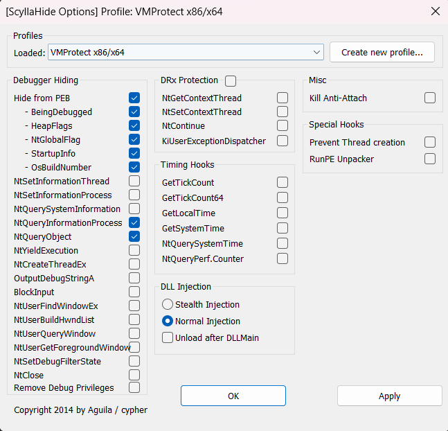

### 4.2 Linux - GDB a patch binárky

#### Metóda 1: GDB - zmena návratovej hodnoty

Táto metóda využíva schopnosť GDB meniť tok vykonávania programu. Cieľom je prinútiť funkciu `check_platform_debug()` vrátiť `false` (0), čím sa všetky anti-debug kontroly preskočia.

**Krok 1: Identifikácia anti-debug funkcie**

Najprv som potreboval nájsť, ktorá funkcia vykonáva anti-debug kontroly. Použil som zachytenie `ptrace` syscall-u:

```gdb
(gdb) catch syscall ptrace
Catchpoint 1 (syscall 'ptrace' [101])
(gdb) run
Starting program: ./linux_antidebug
Catchpoint 1 (call to syscall ptrace), ...
(gdb) backtrace
#0  ptrace (request=PTRACE_TRACEME)
#1  0x000055555555750f in check_platform_debug() ()
#2  0x0000555555557901 in main ()
```

Backtrace ukázal, že `ptrace` je volaný z funkcie `check_platform_debug()`.

**Krok 2: Bypass pomocou predčasného návratu**

Teraz som nastavil breakpoint na začiatok tejto funkcie a prinútil ju okamžite vrátiť `0`:

```gdb
(gdb) break check_platform_debug
Breakpoint 1 at 0x34be
(gdb) run
Breakpoint 1, 0x00005555555574be in check_platform_debug() ()
(gdb) return (int)0
Make selected stack frame return now? (y or n) y
(gdb) continue
```

Príkaz `return (int)0` spôsobí, že funkcia sa okamžite ukončí s návratovou hodnotou `0` (false = žiadny debugger), bez toho aby sa vykonali akékoľvek kontroly vnútri funkcie.

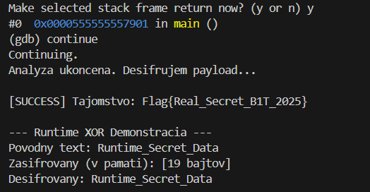

#### Metóda 2: LD_PRELOAD hook

Program detekuje LD_PRELOAD tak, že volá `getenv("LD_PRELOAD")` a kontroluje, či nie je nastavená. Túto detekciu môžeme obísť práve pomocou LD_PRELOAD - vytvoríme vlastnú verziu funkcie `getenv()`, ktorá "klame" o hodnote LD_PRELOAD.

**Princíp útoku:**
- LD_PRELOAD je mechanizmus Linuxu, ktorý načíta knižnicu pred štandardnými knižnicami
- Funkcia `getenv()` prepíše originálnu z `libc`
- Keď program zavolá `getenv("LD_PRELOAD")`, funkcia vráti `NULL` namiesto skutočnej hodnoty

**Implementácia hook knižnice:**

```c
// ldpreload_hook.c
#define _GNU_SOURCE
#include <stdio.h>
#include <stdlib.h>
#include <string.h>
#include <dlfcn.h>

// Hook getenv - skryje LD_PRELOAD premennú
char *getenv(const char *name) {
    static char *(*real_getenv)(const char *) = NULL;
    if (!real_getenv) {
        real_getenv = dlsym(RTLD_NEXT, "getenv");
    }
    
    // Ak sa pýta na LD_PRELOAD, vráť NULL
    if (name && strcmp(name, "LD_PRELOAD") == 0) {
        return NULL;
    }
    
    return real_getenv(name);
}
```

**Kompilácia a použitie:**
```bash
# Kompilácia ako shared library
gcc -shared -fPIC -o ldpreload_hook.so ldpreload_hook.c -ldl

# Spustenie s hook knižnicou - program nedetekuje LD_PRELOAD
LD_PRELOAD=./ldpreload_hook.so ./linux_antidebug
```

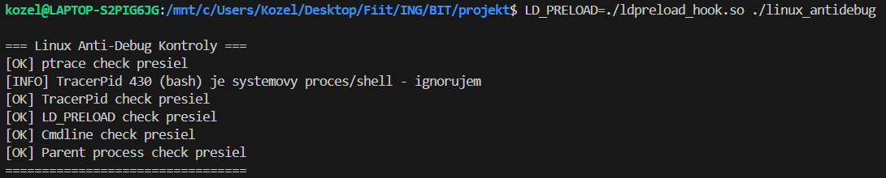

#### Metóda 3: Patch binárky

Táto metóda je najsilnejšia - modifikuje sa priamo binárny súbor, takže zmeny sú trvalé. Je to jediný spôsob ako obísť detekciu `strace`, pretože strace používa kernel-level ptrace, ktorý nie je možné obísť za behu.

**Cieľ:** Prepísať začiatok funkcie `check_platform_debug()` tak, aby okamžite vrátila `0` (false).

Pre obídenie strace detekcie (kernel-level ptrace):

**Krok 1: Nájdenie runtime adresy funkcie**

V GDB som našiel adresu funkcie v pamäti:
```gdb
(gdb) break main
Breakpoint 1 at 0x38e5
(gdb) run
Breakpoint 1, 0x00005555555578e5 in main ()
(gdb) print check_platform_debug
$1 = {<text variable, no debug info>} 0x5555555574b6 <check_platform_debug()>
(gdb) info proc mappings
          Start Addr           End Addr       Size     Offset
      0x555555554000     0x555555556000     0x2000        0x0  r--p  linux_antidebug
      0x555555556000     0x555555559000     0x3000     0x2000  r-xp  linux_antidebug
```

**Krok 2: Výpočet file offsetu**

Z mappings vidím, že executable sekcia (r-xp) začína na `0x555555556000` s file offsetom `0x2000`. Výpočet:
```
runtime_addr = 0x5555555574b6
section_start = 0x555555556000
file_offset = (0x5555555574b6 - 0x555555556000) + 0x2000
            = 0x14b6 + 0x2000
            = 0x34b6
```

**Krok 3: Vytvorenie patch bajtov**

Potrebujem inštrukcie, ktoré:
- Nastavia EAX na 0 (návratová hodnota false)
- Okamžite sa vrátia z funkcie

**Krok 4: Aplikovanie patch**
```bash
# Vytvorenie kópie binárky
cp linux_antidebug linux_antidebug_patched

# Zapísanie patch bajtov na správny offset
printf '\x31\xC0\xC3' | dd of=linux_antidebug_patched bs=1 seek=$((0x34b6)) conv=notrunc

# Nastavenie executable práv
chmod +x linux_antidebug_patched

# Test - teraz strace nedetekuje debugger
strace -o /dev/null ./linux_antidebug_patched
```

| Bajty   | Inštrukcia     | Efekt            |
| ------- | -------------- | ---------------- |
| `31 C0` | `xor eax, eax` | EAX = 0 (false)  |
| `C3`    | `ret`          | Návrat z funkcie |

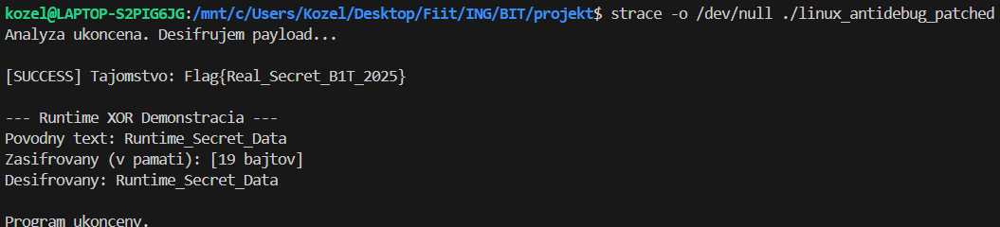

### 4.3 Porovnanie bypass metód

| Platforma | Detekcia                  | Bypass metóda         | Náročnosť  |
| --------- | ------------------------- | --------------------- | ---------- |
| Windows   | IsDebuggerPresent         | RAX = 0 v debuggeri   | Jednoduchá |
| Windows   | PEB->BeingDebugged        | Patch pamäte          | Jednoduchá |
| Windows   | NtQueryInformationProcess | Patch skoku           | Stredná    |
| Windows   | Všetky                    | ScyllaHide plugin     | Jednoduchá |
| Linux     | ptrace + TracerPid        | `return (int)0` v GDB | Stredná    |
| Linux     | LD_PRELOAD                | getenv() hook         | Jednoduchá |
| Linux     | strace (kernel ptrace)    | Patch binárky         | Pokročilá  |

---

## 5. Statická analýza v Ghidra

### 5.1 Cieľ analýzy

Získať zašifrovaný flag a XOR kľúč bez spustenia programu - čisto statickou analýzou.

### 5.2 Postup

**Krok 1:** Import binárky do Ghidra (File → Import File) a automatická analýza.

**Krok 2:** V Symbol Tree → Functions nájsť funkciu `print_real_flag`.

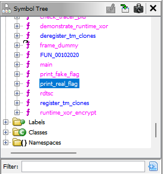

**Krok 3:** Analýza decompilovaného kódu:

```c
void print_real_flag(void) {
    byte local_38[40];
    
    local_38[0] = 0x14;
    local_38[1] = 0x3e;
    local_38[2] = 0x33;
    // ... ďalšie bajty ...
    
    for (local_40 = 0; local_40 < 0x1a; local_40++) {
        std::operator<<(std::cout, local_38[local_40] ^ 0x52);
    }
}
```

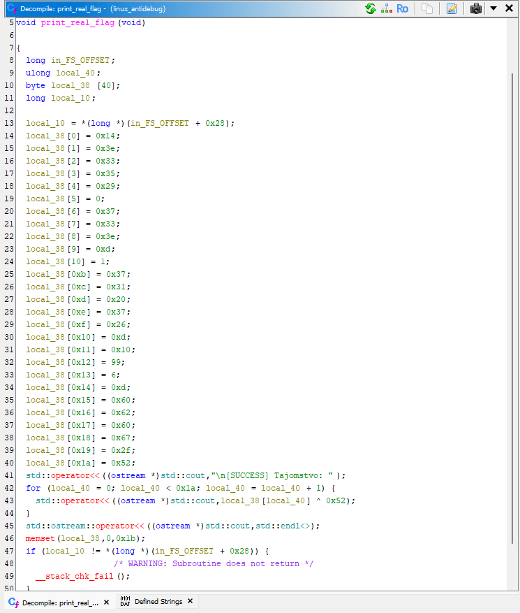

**Identifikované hodnoty:**
| Parameter      | Hodnota                  |
| -------------- | ------------------------ |
| Encrypted data | Pole bajtov `local_38[]` |
| XOR kľúč       | `0x52`                   |
| Dĺžka flagu    | `0x1a` (26 znakov)       |

### 5.3 Dešifrovanie

```python
encrypted = [
    0x14, 0x3e, 0x33, 0x35, 0x29, 0x00, 0x37, 0x33,
    0x3e, 0x0d, 0x01, 0x37, 0x31, 0x20, 0x37, 0x26,
    0x0d, 0x10, 0x63, 0x06, 0x0d, 0x60, 0x62, 0x60,
    0x67, 0x2f
]
key = 0x52

decrypted = ''.join(chr(b ^ key) for b in encrypted)
print(f"Decrypted flag: {decrypted}")
```


---

## 6. Komparatívna analýza

### 6.1 Efektivita XOR obfuskácie

| Metrika                    | Pred obfuskáciou | Po obfuskácii |
| -------------------------- | ---------------- | ------------- |
| Viditeľnosť v `strings`    | ✅ Viditeľné      | ❌ Skryté      |
| Čas na extrakciu (strings) | < 1 sekunda      | N/A           |
| Čas na extrakciu (Ghidra)  | N/A              | ~10 minút     |


### 6.2 Efektivita anti-debug techník


| Technika                   | Detekcia debuggera | Čas na bypass | Náročnosť bypass |
| -------------------------- | ------------------ | ------------- | ---------------- |
| IsDebuggerPresent          | ✅                  | < 1 min       | Jednoduchá       |
| PEB->BeingDebugged         | ✅                  | < 1 min       | Jednoduchá       |
| CheckRemoteDebuggerPresent | ✅                  | < 1 min       | Jednoduchá       |
| NtQueryInformationProcess  | ✅                  | 2-3 min       | Stredná          |
| ptrace                     | ✅                  | 2-3 min       | Stredná          |
| TracerPid                  | ✅                  | 2-3 min       | Stredná          |
| LD_PRELOAD                 | ✅                  | 5 min         | Stredná          |
| Patch binárky (strace)     | ✅                  | 10 min        | Pokročilá        |


#### **Poznámka:** Uvedené časy na bypass sú pre skúsených reverzných inžinierov. Pre začiatočníkov môže byť čas na obídenie týchto techník niekoľkonásobne až rádovo vyšší (hodiny namiesto minút - môj prípad).
---

## 7. Záver

### 7.1 Zhrnutie výsledkov

Projekt úspešne implementoval a otestoval:

1. **Compile-time XOR obfuskáciu** - efektívne skrýva reťazce pred nástrojom `strings`, ale je zraniteľná voči statickej analýze v Ghidra

2. **Anti-debug techniky** - úspešne detekujú prítomnosť debuggerov, ale každá technika má známy bypass

3. **Metódy obchádzania** - dokumentované postupy pre x64dbg, GDB, LD_PRELOAD hooking a patch binárky

### 7.2 Odporúčania pre reálne použitie

| Odporúčanie                      | Dôvod                                        |
| -------------------------------- | -------------------------------------------- |
| Kombinovať viacero techník       | Žiadna jednotlivá technika nie je dostatočná |
| Používať polymorfnú obfuskáciu   | Komplikuje statickú analýzu                  |
| Implementovať integrity kontroly | Detekcia patchovania binárky                 |
| Obfuskovať control flow          | Sťažuje pochopenie logiky                    |
| Používať anti-tamper techniky    | Ochrana proti modifikácii                    |

### 7.3 Limitácie projektu

- Implementované techniky sú základné a dobre zdokumentované
- Skúsený útočník ich dokáže obísť v priebehu minút
- Pre produkčné nasadenie je potrebná pokročilejšia ochrana (VMProtect, Themida, custom riešenia)